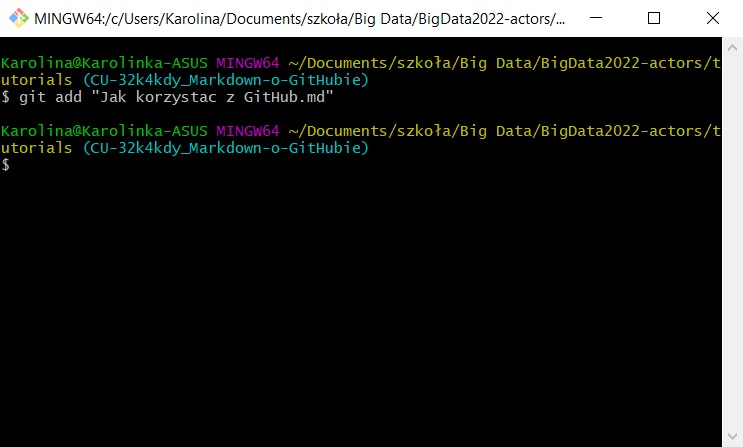
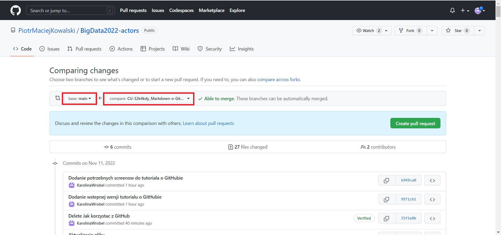

Dokument ma na celu wytłumaczenie w jaki sposób korzystać z GitHuba.

## Co to jest GitHub?

GitHub to serwis pozwalający na przechowywanie projektów przy pełnej kontroli wersji każdego pliku. Przechowywane są na nim kody źródłowe plików, a wszystkie wprowadzone zmiany są zaznaczane w tym kodzie jako usunięcia lub dodania linii, a dodatkowo powinny być również opisane komentarzem autora zmian. Dzięki temu mamy pełną przejrzystość wprowadzanych zmian oraz w każdej chwili możemy wrócić do poprzedniej wersji pliku. Na jednym repozytorium może działać kilka osób, jednocześnie wprowadzając zmiany.

## Struktura projektu na GitHubie

Dla każdego projektu na GitHubie zakładane jest osobne ***repozytorium***, czyli katalog, w którym przechowywane są wszystkie wersjonowane pliki. W repozytorium możemy tworzyć ***foldery***, które pomogą uporządkować ***pliki*** tworzące nasz projekt. To właśnie dla każdego z tych plików będzie zapisana historia wersji z widocznymi zmianami.

Ponieważ na jednym repozytorium może pracować cały zespół, oznacza to, że ciężko byłoby pracować na pliku zawierającym kod, który cały czas się zmienia. Dlatego GitHub umożliwia pracę na wielu ***branchach***, czyli gałęziach projektu. Głównym branchem każdego projektu jest ***main***. To tam trafia zatwierdzony kod, który jest już częścią głównego projektu. Otwierając nowy branch, zaczynamy pracować "obok" głównej gałęzi, zmieniając pliki, nad którymi pracujemy, a po skończonej pracy i zatwierdzonym review, nasze zmiany są ***merge'owane*** do brancha main.

## Jak rozpocząć pracę z GitHubem?

Na początku każdego nowego zadania, którego wykonania się podjęliśmy, musim otworzyć nowy branch. Możemy to zrobić na dwa sposoby:

1. Stworzenie brancha przez click up:

* Otwórz swoje zadanie na click upie,
* Kliknij ikonkę GitHuba,

    
* Kliknij "Create branch",

    
* Wybierz repozytorium oraz branch, z którego ma wychodzić nowy branch (zazwyczaj będzie to main),

    
* Kliknij "Create new branch".

    

2. Stworzenie brancha przez GitHub:

* Wejdź w zakładkę branches,

    
* Kliknij "New branch:,
    
    
* Wpisz nazwę nowego brancha,

    
* Kliknij "Create branch".

    

Nowy branch został już utworzony na repozytorium i możesz teraz wprowadzać na nim swoje zmiany.

Kolejnym zadaniem na GitHubie jest zapisanie dokonanych zmian, gdyż zmiany nie są zapisywane na bieżąco w trakie pracy, ale dopiero po zrobieniu ***commita***, czyli polecenia zapisania zmian na repozytorium zdalnym. Tu znów mamy kilka opcji zapisywania zmian, w zależności od tego na czym pracujemy:

1. Zapisywanie zmian przez Google Colab:

* Wejdź w zakładkę "Plik" i kliknij "Zapisz kopię w usłudze GitHub",

    
* Wybierz repozytorium oraz gałąź (branch twojego zadania), na którym chcesz zapisać zmiany,

    
* Wpisz króki komentarz na temat wprowadzonych zmian i kliknij "OK".

    

2. Zapisywanie zmian przez terminal:

    2.1. Aby móc wprowadzać zmiany przez terminal, najpierw musimy mieć lokalnie skopiowane (sklonowane) repozytorium (robimy to tylko raz),
* Utwórz pusty katalog, w którym chcesz mieć lokalnie skopiowane repozytorium (u mnie Big Data2),
* Kliknij prawym przyciskiem myszy, a następnie "Git Bash Here" (do tego musisz mieć zainstalowanego Git Basha - [Git Bash download](https://gitforwindows.org/)),

    
* Poczekaj, aż terminal będzie gotowy do działania (pojawi się znaczek dolara),

    
* W terminalu wpisz komendę (jeśli chcesz ją skopiować i wkleić, pamietaj, że skrót klawiszowy Ctrl + V nie działa w terminalu. Proponuję użyć prawego klawisza myszy, aby wkleić komendę) `git clone https://github.com/PiotrMaciejKowalski/BigData2022-actors.git` i kliknij Enter.

    

    2.2. Jeśli już masz sklonowane repozytorium lokalnie i chcesz wprowadzać kolejne zmiany, warto najpierw "odświeżyć" lokalne repozytorium, aby zmiany wprowadzane przez innych pojawiły się również u nas lokalnie:
* W lokalizacji, gdzie masz lokalne repozytorium, kliknij prawym przyciskiem myszy, a następnie "Git Bash Here", aby otworzyć terminal Git Bash,

    
* Wpisz komendę `git pull`, aby ściągnąc aktualną wersję danego brancha i kliknij Enter (jeśli chcesz zaktualizować całe repozytorium lokalnie użyj komendy `git fetch`.

    

    2.3. Aby wprowadzić zmiany w danym pliku, należy wykonać następujące kroki:
* Otwórz terminal w lokalizacji, gdzie umieściłeś lokalne repozytorium (tak, jak pokazano powyżej),
* Wpisz komendę `git checkout <nazwa_brancha_na_którym_chcemy_wprowadzić_zmiany>` i kliknij Enter. Widzimy, że zmienia się wówczas lokalizacja, w której się znajdujemy:

    
* Wstaw plik, który chcesz dołączyć, w odpowiedniej lokalizacji lub zmienić istniejący plik (ja dodałam plik "Jak korzystać z GitHub.md" do folderu tutorials),

    
* W terminalu wpisz komendę `git add <nazwa_pliku_na_którym_chcemy_wprowadzić_zmiany>` (jeśli w nazwie pliku są spacje, umieść ją w cudzysłowie) i kliknij Enter,

    
* Wpisz komendę `git status`, aby sprawdzić co będzie zmienione w ramach commita i kliknij Enter,

    
* Wpisz komendę `git commit -m "<króki_tekst_opisujący_zapisywane_zmiany>"` i kliknij Enter,

    
* Wpisz komendę `git push` i kliknij Enter,

    
* W celu sprawdzenia, czy pewne zmiany jeszcze nie zostało zapisane na repozytorium zdalnym, możemy wykonać komendę `git status`, która pokaże, które pliki czekają jeszcze na commit (u mnie widać dodane nowe 3 pliki).

    

3. Zapisanie zmian przez Visual Studio Code:

* Sklonuj repozytorium lokalnie tak, jak zostało to pokazane w punkcie 2.1.,
* Jeśli masz już sklonowane repozytorium, przed wprowadzeniem zmian wykonaj `git pull` tak, jak zostało to pokazane w punkcie 2.2.,
* Przejdź do swojego brancha za pomocą komendy `git checkout` tak, jak zostało to pokazane w punkcie 2.3.,
* Otwórz główny katalog projektu w Visual Studio Code,
* Zapisz plik w odpowiednim folderze na repozytorium lokalnym,

    
* Wejdź w zakładkę "Source Control"

    
* Dodaj pliki, w których chciałbyś zapisać zmiany,

    
* Dodaj komentarz opisujący zmiany, które chcesz zapisać,

    
* Kliknij "Commit & Push", aby zapisać zmiany na repozytorium zdalnym.

    

Jeśli wszystkie zmiany dotyczące danego zadania zostały już zapisane na repozytorium, wówczas możemy stworzyć ***pull request***, czyli prośbę o ***merge*** wszystkich zmian z naszego brancha do main. Zanim taki request zostanie zatwierdzony, dodany/zmieniony kod musi przejść ***review***, podczas którego reviewer może mieć pewne sugestie do kodu, komunikując je przez komentarze.

Jak założyć pull request, kiedy skończyliśmy pracę nad danym zadaniem? Tu mamy dwie opcje:

1. Zakładanie pull requesta przez pojawiający się przycisk "Compare & pull request":

* Kliknij przycisk "Compare & pull request" (pojawia się on po zidentyfikowaniu zmian nie wprowadzonych na main),

    
* Dodaj komentarz jeśli chcesz i kliknij "Create pull request",

    
* Przypisz osobę, która ma zrobić review w polu "Assignees".

    

2. Zakładanie pull requesta przez zakładkę "Pull requests":

* Wejdź w zakładkę "Pull requests",

    
* Kliknij "New pull request",

    
* Wybierz, z jakiego brancha do jakiego ma być merge (zazwyczaj będziemy merge'ować do main),

    
* Kliknij "Create pull request",

    
* Dodaj komentarz jeśli chcesz i kliknij "Create pull request",

    
* Przypisz osobę, która ma zrobić review w polu "Assignees".

    

## Przydatne komendy gitowe

| Komenda | Efekt|
| ----- | ----- |
| git status | Wylistowanie plików zmienionych i wymagających dodania i zcommitowania do repozytorium |
| git init | Stworzenie nowego pustego repozytorium |
| git clone /path/to /repository | Skopiowanie repozytorium lokalnie |
| git add <filename> | Dodanie jednego lub wielu plików do stage'u |
| git add * | Dodanie wszystkich zmienionych plików do stage'u |
| git commit -m "Commit message" | Dodanie zmian plików będących w stage'u do lokalnego repozytorium |
| git commit -a | Dodanie zmian wszystkich zmienionych plików do lokalnego repozytorium |
| git push | Dodanie zmian do brancha do zdalnego repozytorium |
| git checkout -b <branch_name> | Utworzenie nowego brancha na bazie bieżącego na lokalnym repozytorium i przełączenie się na niego |
| git checkout <branch_name> | Przełączenie się na dany branch |
| git branch | Wylistowanie wszystkich branchy w danym repozytorium i wyświetlenie, w którym branchu aktualnie jesteśmy |
| git branch -d <branch_name> | Usunięcie brancha na lokalnym repozytorium |
| git push origin <branch_name> | Dodanie utworzonego lokalnie brancha do zdalnego repozytorium |
| git push --all origin | Dodanie wszystkich lokalnych branchy do zdalnego repozytorium |
| git push origin <branch_name> | Usunięcie danego brancha na zdalnym repozytorium |
| git pull | Załadowanie i złączenie plików ze zdalnego repozytorium |
| git merge <branch_name> | Złączenie innego brancha z aktywnym branchem |
| git diff | Wylistowanie wszystkich problemów ze złączeniem branchy |
| git fetch | Podaje informacje na temat zmian, które są wprowadzone na zdalnym repozytorium, a nie ma ich na lokalnym repozytorium |
| git restore <file_name> | Cofanie nie zacommitowanych zmian na danym pliku na repozytorium lokalnym |
| git checkout -- <file_name> | Cofnięcie nie zacommitowanych zmian w danym pliku |

Dokumentację wszystkich gitowych komend można znaleźć pod poniższym linkiem:
[dokumentacja git](https://git-scm.com/docs)
    
## Kilka złotych zasad korzystania z GitHub:
    
1. Do każdego zadania powinien być utworzony nowy branch.
2. Komentarze do commita powinny opisywać wprowadzone zmiany.
3. Pull request powinien być założony dla ukończonego całego zadania lub podzadania, nie dla części.
4. Po założonym pull requestcie przypisujemy reviewera w sekcji Assignees na GitHubie (opisano wyżej), nie przypisujemy reiewera na click upie.
5. Po wprowadzonych zmianach po review, warto odpowiedzieć na komentarze reviewera (np. "zrobione", "zmienione", "dodane").
6. Dyskusję w komentarzach pull requestu zamyka zawsze osoba otwierająca dyskusję (opcja "Resolve conversation").
7. Sekcja Assignees dla danego pull requestu powinna wskazywać osobę, od której wymagane jest aktualnie działanie (np. jeśli reviewer zakończył robić review, powinien przypisać autora kodu, aby wiedział, że pull request jest po jego stronie. Autor po zaadresowaniu komentarzy, powinien ponownie przypisać reviewera, aby ten sprawdził poprawione fragmenty kodu).
8. Nie używamy opcji "Close pull request", zamykającej dany pull request. Oznacza ona rezygnację z chęci zakończenia zadania lub, że problem został rozwiązany gdzie indziej.
9. Zespoły przyjmują stałą zasadę co do tego, kto odpowiada za merge danego pull requesta. Np. obecnie wykonuje to dr Kowalski, ale docelowo chcemy aby nasz lider to robił.
10. Konflikty związane z merge'owaniem branchy rozwiązuje osoba merge'ująca branche.
11. Nigdy nie merge'ujemy bez uzyskania approve.
