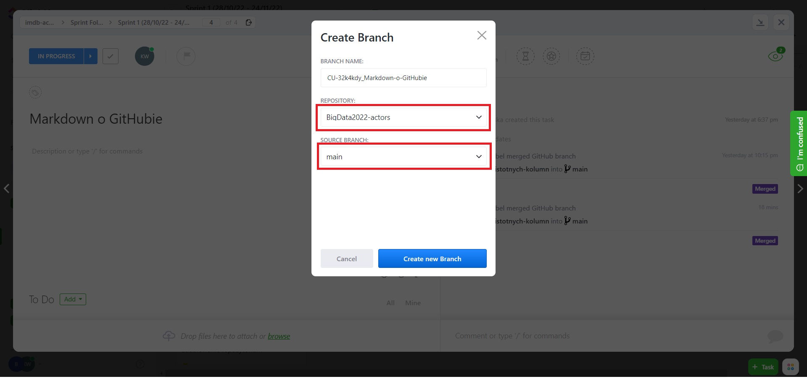
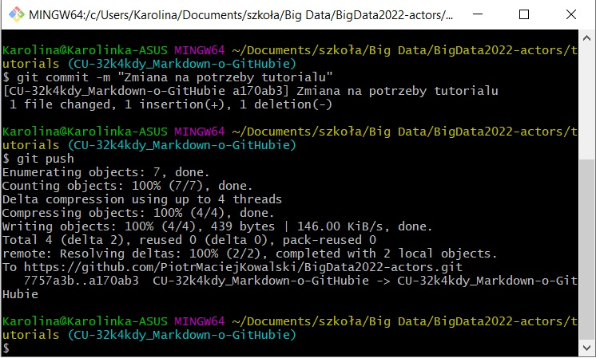
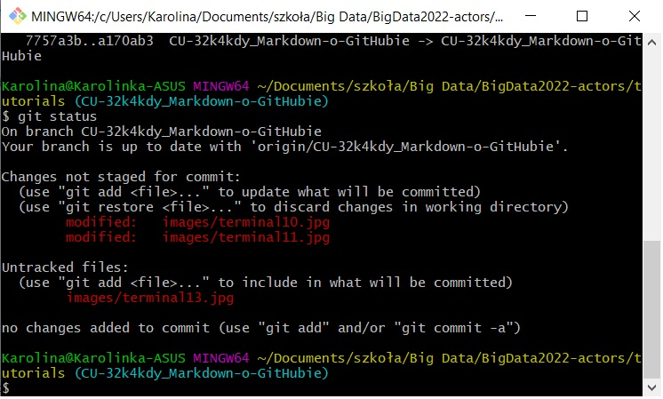

# Dokument ma na celu wytłumaczenie w jaki sposób korzystać z GitHuba.

## Co to jest GitHub?

GitHub to serwis pozwalający na przechowywanie projektów przy pełnej kontroli wersji każdego pliku. Przechowywane są na nim kody źródłowe plików, a wszystkie wprowadzone zmiany są zaznaczane w tym kodzie jako usunięcia lub dodania linii, a dodatkowo powinny być również opisane komentarzem autora zmian. Dzięki temu mamy pełną przejrzytość wprowadzanych zmian oraz w każdej chwili możemy wrócić do poprzedniej wersji pliku. Na jednym repozytorium może działać kilka osób, jednocześnie wprowadzając zmiany.

## Struktura projektu na GitHubie

Dla każdego projektu na GitHubie zakładane jest osobne ***repozytorium***, czyli katalog, w którym przechowywane są wszystkie "kontrolowane" pliki. W repozytorium możemy tworzyć ***foldery***, które pomogą uporządkować ***pliki*** tworzące nasz projekt. To właśnie dla każdego z tych plików będzie zapisana historia wersji z widocznymi zmianami.

Ponieważ na jednym repozytorium może pracować cały zespół, oznacza to, że ciężko byłoby pracować na pliku zawierającym kod, który cały czas się zmienia. Dlatego GitHub umożliwia pracę na wielu ***branchach***, czyli gałęziach projektu. Głównym branchem każdego projektu jest ***main***. To tam trafia zatwierdzony kod, który jest już częścią głównego projektu. Otwierając nowy branch, zaczynamy pracować "obok" głównej gałęzi, zmieniając pliki, nad którymi pracujemy, a po skończonej pracy i zatwierdzonym review, nasze zmiany są ***merge'owane*** do brancha main.

## Jak rozpocząć pracę z GitHubem?

Na początku każdego nowego zadania, którego wykonania się podjęliśmy, musim otworzyć nowy branch. Możemy to zrobić na dwa sposoby:

1. Stworzenie brancha przez click up:

* Otwórz swoje zadanie na click upie,
* Kliknij ikonkę GitHuba,

* Kliknij "Create branch",

* Wybierz repozytorium oraz branch, z którego ma wychodzić nowy branch (zazwyczaj będzie to main),

* Kliknij "Create new branch".

2. Stworzenie brancha przez GitHub:

* Wejdź w zakładkę branches,

* Kliknij "New branch:,

* Wpisz nazwę nowego brancha,

* Kliknij "Create branch".

Nowy branch został już utworzony na repozytorium i możesz teraz wprowadzać na nim swoje zmiany.

Kolejnym zadaniem na GitHubie jest zapisanie dokonanych zmian, gdyż zmiany nie są zapisywane na bieżąco w trakie pracy, ale dopiero po zrobieniu ***commita***, czyli polecenia zapisania zmian na repozytorium. Tu znów mamy kilka opcji zapisywania zmian, w zależności od tego na czym pracujemy:

1. Zapisywanie zmian przez Google Colab:

* Wejdź w zakładkę "Plik" i kliknij "Zapisz kopię w usłudze GitHub",

* Wybierz repozytorium oraz gałąź (branch twojego zadania), na którym chcesz zapisać zmiany,

* Wpisz króki komentarz na temat wprowadzonych zmian i kliknij "OK".

2. Zapisywanie zmian przez terminal:

    2.1 Aby móc wprowadzać zmiany przez terminal, najpierw musimy mieć lokalnie skopiowane repozytorium (robimy to tylko raz),
* Utwórz plik, w którym chcesz mieć lokalnie skopiowane repozytorium (u mnie Big Data2),
* Kliknij prawym przyciskiem myszy, a następnie "Git Bash Here" (do tego musisz mieć zainstalowanego Git Basha),

* Poczekaj, aż terminal będzie gotowy do działania (pojawi się znaczek dolara),

* W terminalu wpisz komendę (jeśli chcesz ją skopiować i wkleić, pamietaj, że skrót klawiszowy Ctrl + V nie działa w terminalu. Proponuję użyć prawego klawisza myszy, aby wkleić komendę) `git clone https://github.com/PiotrMaciejKowalski/BigData2022-actors.git` i kliknij Enter.

    2.2 Jeśli już masz sklonowane repozytorium lokalnie i chcesz wprowadzać kolejne zmiany, warto najpierw "odświeżyć" lokalne repozytorium, aby zmiany wprowadzane przez innych pojawiły się również u nas lokalnie:
* W lokalizacji, gdzie masz lokalne repozytorium, kliknij prawym przyciskiem myszy, a następnie "Git BashHere", aby otworzyć terminal Git Bash,

* Wpisz komendę `git pull`, aby ściągnąc aktualną wersję repozytorium i kliknij Enter.

    2.3 Aby wprowadzić zmiany w danym pliku, należy:
* Otwórz terminal w lokalizacji, gdzie umieściłeś lokalne repozytorium (pokazane powyżej),
* Wpisz komendę `git checkout nazwa_brancha_na_którym_chcemy_wprowadzić_zmiany` i kliknij Enter. Widzimy, że zmienia się wówczas lokalizacja, wktórej się znajdujemy:

* Wstaw plik, któy chcesz dołączyć, w odpowiedniej lokalizacji lub zmienić istniejący plik (ja dodałam plik "Jak korzystać z GitHub.md" do folderu tutorials),

* W terminalu wpisz komendę `git add nazwa_pliku_na_którym_chcemy_wprowadzić_zmiany` lub jeśli chcesz wprowadzić wszystkie wprowadzone zmiany w ramach twojego branch wpisz komendę `git add .` i kliknij Enter,
* 
* Wpisz komendę `git commit -m "króki_tekst_opisujący_zapisywane_zmiany"` i kliknij Enter,

* Wpisz komendę `git push` i kliknij Enter,

* W celu sprawdzenia, czy coś jeszcze nie zostało zapisane na repozytorium, możemy wykonać komendę `git status`, która pokaże, które pliki czekają jeszcze na commit (u mnie widać dodane nowe 3 pliki).

3. Zapisanie zmian przez Visual Studio Code:

* 

