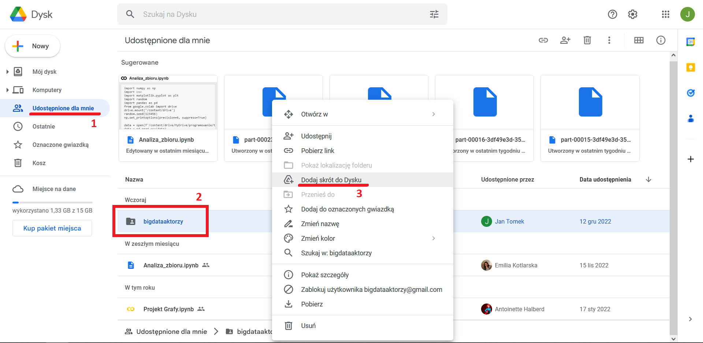
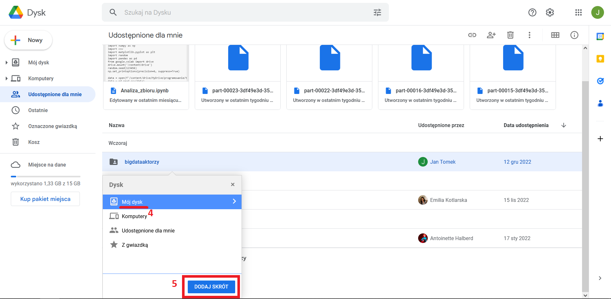
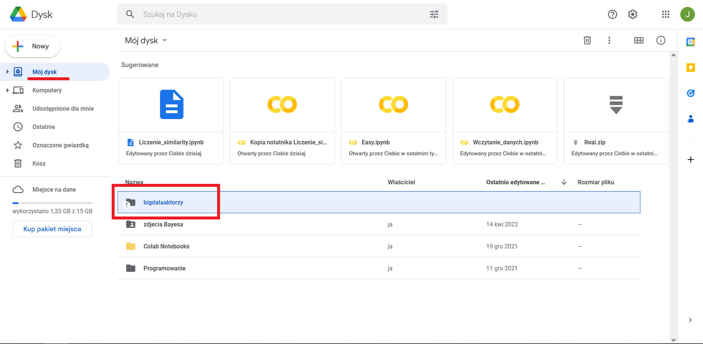

Poradnik pokazuje jak stworzyć skrót do współdzielonego folderu "bigdataaktorzy", żeby być w stanie dostać się do lokalizacji "/content/gdrive/MyDrive/bigdataaktorzy" i wczytać odpowiednie dane.
Aby to zrobić wystarczy wykonać następujące kroki:

1. Po udostępnieniu nam folderu wchodzimy w naszym dysku Google w folder "Udostępnione dla mnie";
2. odnajdujemy współdzielony folder "bigdataaktorzy";
3. klikamy prawym przyciskiem myszy na folder i wybieramy opcję "Dodaj skrót do Dysku".
    
4. Następnie upewniamy się, że skrót zostanie utworzony w lokalizacji "Mój dysk";
5. klikamy przycisk "DODAJ SKRÓT".
    
Teraz wracając do zakładki "Mój dysk" widzimy utworzony przez nas skrót do współdzielonego folderu.
    
